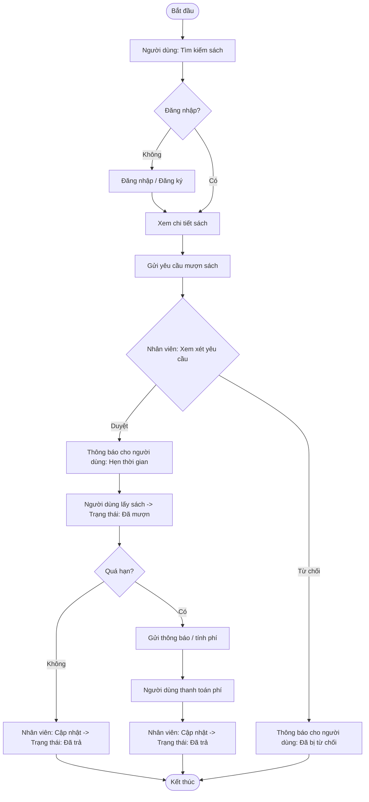

# Hệ Thống Quản Lý Mượn Trả Sách Thư Viện (Library Borrowing Management System)
<b> Đường dẫn dự án: </b> [Code](https://github.com/lthnhuw/B2106803_LeThiHuynhNhu_project)
## 1. Tổng Quan Dự Án   
- <B> Mục tiêu: </B> Tự động hóa và tối ưu hóa quy trình mượn – trả sách nhằm nâng cao hiệu quả hoạt động và trải nghiệm người dùng.
- <B> Vấn đề: </B> Quản lý thủ công gây ra tình trạng chậm trễ, thiếu minh bạch, và khó khăn trong việc tra cứu hoặc theo dõi sách quá hạn.
- <B> Các bên liên quan: </B> Nhân viên thư viện (quản trị viên) và độc giả (người dùng).

## 2. Nhu Cầu và Mục Tiêu Kinh Doanh 
- Cung cấp nền tảng tập trung giúp độc giả tra cứu, mượn và theo dõi tình trạng sách.
- Cho phép nhân viên thư viện quản lý sách, nhà xuất bản và hoạt động mượn – trả một cách hiệu quả.
- Giảm tải công việc thủ công và tăng độ chính xác dữ liệu thông qua theo dõi thời gian thực (real-time tracking).

## 3. Phân Tích Yêu Cầu 
### Yêu Cầu Chức Năng  

| Người dùng (Readers)                                   | Nhân Viên (Staff)                                    |
|------------------------------------------------|----------------------------------------------|
|Đăng ký, đăng nhập và quản lý tài khoản cá nhân.|Quản lý sách và nhà xuất bản (thêm/sửa/xóa).|
|Tìm kiếm sách, xem chi tiết, mượn và trả sách.| Duyệt hoặc từ chối yêu cầu mượn sách.|
|Theo dõi lịch sử mượn sách.|Xem báo cáo và thống kê hoạt động mượn – trả.|

### Yêu Cầu Phi Chức Năng 
- Giao diện đơn giản, thân thiện với người dùng.
- Hệ thống bảo mật tài khoản (xác thực, mã hóa dữ liệu).
- Khả năng mở rộng khi dữ liệu tăng lên.

## 4. Kỹ Thuật Phân Tích Nghiệp Vụ  
- <B> Biểu đồ Use Case: </B> Mô hình hóa các tương tác giữa nhân viên và độc giả.

- <B> Biểu đồ lớp (Class Diagram):</B> Xác định các thực thể dữ liệu: Readers, Staff, Books, Publishers, Borrowing Records.
  
- <b> Luồng xử lí (Process Flow): </b> - <b> Process Flow: </b> Mô tả quy trình mượn và trả sách.

- <b> Wireframes: </b> Thiết kế giao diện mẫu cho cổng người dùng và nhân viên.
  

## 5. Kết Quả Chính  
- Biểu đồ Use Case có các chức năng: Đăng ký, Đăng nhập, Mượn/Trả, Quản lý.
- Biểu đồ lớp với các thuộc tính và mối quan hệ giữa các thực thể.
- Wireframe cho giao diện chính: Đăng nhập, Tìm kiếm sách, Lịch sử mượn, Bảng điều khiển quản lý.
- Tài liệu đặc tả yêu cầu hệ thống (Functional & Non-functional Requirements).
## 6. Đánh Giá và Cải Tiến 
- Hạn chế:
  -  Thiếu chức năng khôi phục mật khẩu.
  -  Giao diện người dùng chưa tối ưu (UX chưa thân thiện).
  -  Chưa hỗ trợ người dùng cập nhật hồ sơ cá nhân.
- Đề xuất cải tiến:
  - Thêm tính năng quản lý tài khoản (chỉnh sửa hồ sơ, khôi phục mật khẩu).
  - Cải thiện thiết kế responsive để hỗ trợ đa nền tảng.
  - Tích hợp bảng điều khiển quản trị (Admin Dashboard) theo dõi toàn bộ người dùng và hoạt động mượn – trả.
 
## 7. Kỹ Năng Ứng Dụng
Phân tích yêu cầu nghiệp vụ, mô hình hóa UML (Use Case, Class Diagram), mô hình quy trình, thiết kế wireframe, đánh giá UX và viết tài liệu hệ thống.

## 8. Phản Hồi và Tự Đánh Giá  
Thông qua dự án này, tôi rèn luyện kỹ năng phân tích nhu cầu kinh doanh, mô hình hóa quy trình làm việc, và chuyển đổi yêu cầu nghiệp vụ thành giải pháp kỹ thuật tiềm năng, kết nối giữa người dùng, nghiệp vụ và nhóm phát triển.
